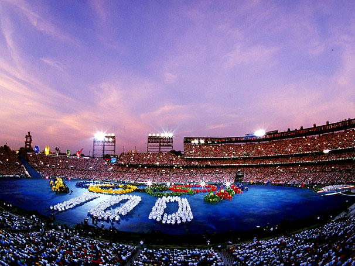
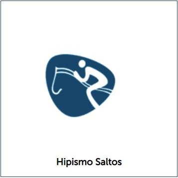
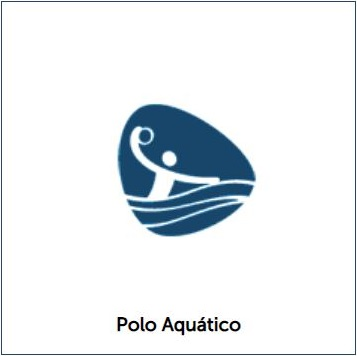
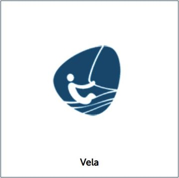

# Olimpiadas2020
<!DOCTYPE html>
<html>
    <head>
        <title>
            Olimpíadas 2020
        </title>

        <link rel="stylesheet" href="css/index.css" />

        <meta charset="utf-8">
    
    </head>
    <body>
            
        

            <ul>
                <li> </li>
                <li><a href="#historia">História</a> </li>
                <li><a href="#datas_marcantes">Datas Marcantes</a> </li>
                <li><a href="#listas_de_esportes">Lista de Esportes</a> </li>
                
            </ul> 
        

        <h1> Olimpíadas 2020</h1>
               
        <h2>  </h2>
        
        

            <ul>
                <li><a href="">
História
</a> </li>
            </ul>
        

        
        

            
        

            

            Em 6 de abril de 1896 começava em Atenas, na Grécia, a primeira edição dos Jogos Olímpicos da era moderna.

            O renascimento do espírito olímpico, interrompido no ano 392, deveu-se ao francês Barão de Coubertin
            
            Charles Freddye Pierre era o nome do Barão de Coubertin, pai da Olimpíada Moderna.
            
            Motivado pelo ideal da educação através do esporte, Coubertin queria propagar seu uso como um instrumento de aproximação entre os povos, em benefício da paz. A célebre frase "o importante é competir" é atribuída ao barão francês.
            
            Em junho de 1894, apoiado pelo norte-americano William Sloane e pelo inglês Charles Herbert, e na presença de representantes de 15 países, Coubertin fundou em Sorbonne, na França, o órgão precursor do Comitê Olímpico Internacional. Até hoje, esse organismo controla todo o mundo olímpico.
            
            Coubertin planejava a primeira edição dos Jogos para 1900, em Paris, durante a Exposição Mundial, mas o príncipe Constantino da Grécia ficou tão empolgado com a ideia de recomeçar a competição no mesmo país onde ela havia terminado 16 séculos antes, que conseguiu organizá-los em dois anos. Em 6 de abril de 1896, então, foram inaugurados os primeiros Jogos Olímpicos da Era Moderna.

           
<u> Abertura virou marca registrada! </u>

           
           
 
            Foram 241 atletas de 15 países participaram da competição idealizada pelo francês Pierre de Frédy, o Barão de Coubertin. 
            
            Nas nove modalidades presentes na disputa - atletismo, ciclismo, esgrima, ginástica, halterofilismo, luta, natação, tênis e tiro -, somente atletas amadores podiam participar. 
           
            Na data comemorativa, desta terça-feira, o Google utilizou-se de “Doodles”para celebrar a data.
           

        
        

            <ul>
                <li><a href = "">
Datas Marcantes
</a></li>
            </ul>
        

    

        <strong> 1936 (Berlim): Atleta americano negro faz ruir o mito da supremacia ariana </strong>
    
Diante de Hitler,o atleta americano Jesse Owens ganhou nada menos do que quatro medalhas de ouro na Olimpíada de Berlim.
        Justamente quando Adolph Hitler tentava provar sua teoria de que os brancos eram superiores.<u>Owen era negro.</u>
        Não haveria Jogos Olímpidos nos anos seguintes (1940 e 1944), por conta da guerra. Os jogos de 1940 seriam no Japão e os de 1944, em Londres. 
        Em 1948, Japão e Alemanha, que perderam a guerra, foram banidos dos jogos de Londres.
    
 

     

    <video class="imgFullWidth" controls>
    <source src="videos/berlim.mp4" type="video/mp4">
      </video>
    

    

    <strong>   1960 (Roma): O atleta descalço e o banimento da África do Sul </strong>
    

        O desconhecido atleta etíope Abebe Bikila tornou-se o primeiro africano a ganhar uma medalha de ouro nos jogos. Justamente na Itália que havia invadido seu país, nos anos 30.
        Bikila correu a maratona sob o sol escaldante de Roma completamente descalço.
        Quatro anos depois, bateu seu próprio recorde, nas Olimpíadas de Tóquio. Outro fato político importante dessa Olimpíada foi o banimento da África do Sul por conta do Apartheid. 
        A África do Sul só voltaria a competir nas Olimpíadas de Barcelona, em 1992.
    

    
    

    
    

    

   
     <strong> 1968 (México): Protesto contra o racismo   </strong>
     

        O conturbado ano de 1968 teve reflexos nos esportes. A Europa estava em ebulição, o Brasil em plena ditadura. 
        Nos EUA, Robert Kennedy e o líder do movimento negro Martin Luther King haviam sido assassinados.
        Nesse clima, os corredores americanos Tommie Smith e John Carlos – medalhas de ouro e bronze nos 200 metros – subiram ao pódio trajando meias negras sem sapatos, broches do movimento pelos direitos civis e, ao som do hino americano, baixaram a cabeça e ergueram os punhos cerrados, cobertos por uma luva também negra. 
        Era a saudação do movimento negro. Os atletas foram suspensos, mas seus gestos entraram para a História.
     

     
     

        <video class="imgFullWidth"  controls>
        <source src="videos/mexico.mp4" type="video/mp4">
          </video>
        

    

    <strong> 1972 (Munique): Atentado à delegação de Israel </strong>
    

        Um grupo de oito terroristas palestinos entrou no alojamento da delegação de Israel, lutou com atletas e manteve 11 deles reféns. 
        Em troca, exigiram a libertação de presos detidos em Israel. (Dizem que neonazistas alemães facilitaram sua entrada no local olímpico, mas nada foi comprovado). 
        Israel se negou a negociar com os terroristas.
        Numa ação desastrosa, todos os reféns morreram, além de um policial alemão e cinco terroristas. 
        Os jogos foram interrompidos por dois dias e uma cerimônia de repúdio foi realizada.
    

    
    

    
    

    

    <strong>  1980 (Moscou): O maior boicote da História </strong>
    

        Em plena Guerra Fria, 69 países aderiram ao boicote dos Jogos Olímpicos de Moscou promovido pelos EUA – o Brasil, no entanto, participou da esvaziada competição. 
        Nenhuma TV americana transmitiu os jogos. Mas a emocionante imagem do mascote Misha, o ursinho chorão, ganhou o mundo. 
        Até hoje Misha é o mascote mais lembrado dos jogos.
    

  
    

    
    

    

    <strong> 1984 (Los Angeles): A vez dos comunistas </strong>
    

        Ao contrário dos russos, os americanos não choraram e não fizeram nenhuma menção ao boicote - desta vez por parte dos países alinhados à União Soviética. 
        As Olimpíadas de Los Angeles foram hiperproduzidas e midiáticas, mas a ausência dos soviéticos, dos cubanos e dos alemães orientais prejudicaram bastante a qualidade dos jogos.
        O destaque, além da participação americana, foi a da China, que resolveu não boicotar. 
        Os países que boicotaram organizaram quase na mesma época uma outra competição de alto nível chamada Jogos da Amizade.
    

    
    

    
    

    

    <strong>  1992 (Barcelona): Alemanha unificada e a volta da África do Sul </strong>
    

        As Olimpíadas de Barcelona revitalizaram completamente a cidade e foram marcadas pela volta de uma só Alemanha (após a queda do Muro de Berlim) e da África do Sul à competição. 
        Com o fim da URSS, os soviéticos se juntaram a mais 12 territórios e formaram a Comunidade dos Estados Independentes, que viria a terminar em primeiro lugar no quadro geral de medalhas.
        O esporte sentia a mudança do mundo após o fim da Guerra Fria. 
        Nelson Mandela só seria eleito presidente da África do Sul em 1994, mas em 1992 já havia deixado a cadeia e seu país ganhou a chance de voltar à competição.
    

    
    

    
    

   

    <strong> 1996 (Atlanta): Atentado </strong>
    

        Anos antes do 11 de setembro, os EUA já conviviam com um atentado de grandes proporções, num local público: uma bomba explodiu dentro do Parque Olímpico Centennial, sede dos Jogos de Atlanta, matando duas pessoas e ferindo 150.
        O autor do atentado, Eric Rudolph, era um americano radical de extrema direita; foi preso em 2003 e condenado à prisão perpétua. 
        O plano do radical era cancelar os jogos, o que não aconteceu. E ainda teve Mohammad Ali acendendo a tocha, mesmo com os sintomas do Mal de Parkinson ... 
        prova de que a emoção sempre vence o terror.
    

    
    

    
    

    

    <strong> 2012 (Londres): O poder feminino </strong>
    

    Pela primeira vez na história dos Jogos, todos os países enviaram mulheres em suas delegações. 
    As atletas de origem muçulmana competiram com véu e tudo. A Olimpíada de Londres ficou conhecida também como a mais bem organizada de todas.
    

    
    

    
    

    

    <strong>2016 (Rio): Time de refugiados</strong>
    

    Um momento político marcante é esperado para as Olimpíadas do Rio. 
    O COI aprovou a participação de uma equipe de refugiados.
    O Team Refugee tem apoio das Nações Unidas e deverá chamar atenção para uma das maiores tragédias da História: 
    atualmente, mais de 65 milhões de pessoas no mundo foram obrigadas a deixar suas casas por conta de conflitos ou questões econômicas.
    

    

        
        
        

    
    

        <ul>
            <li><a href = "">
Listas de Esportes
</a> </li>
        </ul>
    

   
    <strong>
        Esportes Olímpicos 2020!
    </strong>
   
    

    Para os Jogos Olímpicos de Tóquio 2020, teremos as seguintes modalidades: 
    

   
    <table class="table" >
        <tr>
            <td> </td>
            <td></td>
            <td></td>
        </tr>
        <tr>
            <td></td>
            <td></td>
            <td></td>
        </tr>
        <tr>
           <td></td> 
           <td></td>
           <td></td>
        </tr>
        <tr>
            <td></td>
            <td></td>
            <td></td>
        </tr>
        <tr>
           <td></td>
           <td></td> 
           <td></td>
        </tr>
        <tr>
           <td></td> 
           <td></td>
           <td></td>
        </tr>
        <tr>
            <td></td>
            <td></td>
            <td></td>
        </tr>
        <tr>
            <td></td>
            <td></td>
            <td></td>
        </tr>
        <tr>
            <td></td>
            <td></td>
            <td></td>
        </tr>
        <tr>
            <td></td>
            <td></td>
            <td></td>
        </tr>
        <tr>
            <td></td>
            <td></td>
            <td></td>
        </tr>
        <tr>
            <td></td>
            <td></td>
            <td></td>
        </tr>
        <tr>
            <td></td>
            <td></td>
            <td></td>
        </tr>
        <tr>
            <td></td>
            <td></td>
            <td></td>
        </tr>
    </table>

    

        <ul>
            <li><a href = "">
Inicio
</a> </li>
        </ul>
    

    </body>
</html>
